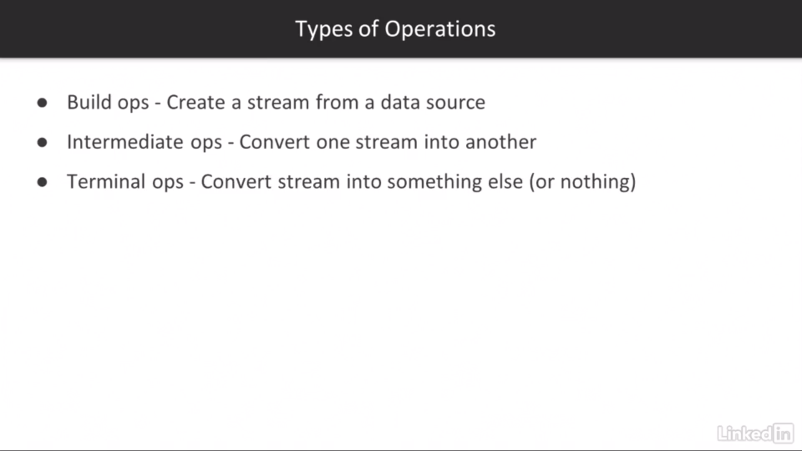
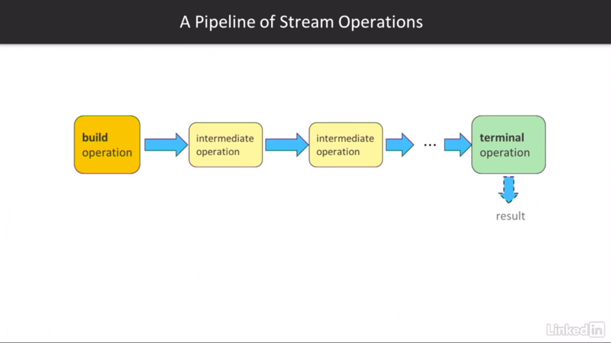

# Functional Programming with Streams in Java 9

## Old Functional Interfaces (Before Java 8)

### 1. Runnable Functional Interface

* Represents the body of a thread
    <pre>
    interface Runnable {
        void run();
    }</pre>
    
* Use with the following constructor
    * <pre>public Thread(Runnable r)</pre>


### 2. Callable Functional Interface

* Represents the body of a thread returning a value
    <pre>interface Callable&lt;V&gt; {
        V call();
    }</pre>
    
* Use with the following method of interface ExecutorService
    * <pre>&lt;V&gt; Future&lt;V&gt; submit(Callable&lt;V&gt; task)</pre>


### 3. Comparator Functional Interface

* Represents an external ordering criterion for a class
    <pre>interface Comparator&lt;T&gt; {
    int compare(T first, T second);
    }
    </pre>
* Use with the following method of class Collections
    * <pre>public static &lt;T&gt; void sort(List&lt;T&gt; list, Comparator&lt;? super T&gt; c</pre>

* Comparator is a pure Functional Interface
    * A stateless object comparing two other objects
* Comparable is the opposite of a pure Functional Interface
    * It needs state
    * Otherwise, comparision with another object would be meaningless


## New Functional Interfaces (From Java 8)

* Package <pre>java.util.Function</pre>
* Over 40 Functional Interfaces
* All common types of functions, ready to use

|Function Type|Functional Interface|
|:-------------:|:--------------------:|
|nothing -&gt; T| Supplier|
|T -&gt; nothing|Consumer|
|T -&gt; T| UnaryOperator|
|T, T -&gt; T| BinaryOperator|
|S -&gt; T| Function|
|T -&gt; boolean | Predicate|

### 1. Consumer and Supplier
* A function accepting an object
  <pre>interface Consumer&lt;T&gt; {
      void accept(T t);
  }</pre>
* A function producing an object
  <pre>interface Supplier&lt;T&gt; {
      T get();
  }</pre>

### 2. UnaryOperator Functional Interface
* Represents an object updater/modifier, which preserves the type
* Use with the following method of interface List&lt;T&gt;
  <pre>void replaceAll(UnaryOperator&lt;T&gt; op)</pre>

<pre>
Syntax:
interface UnaryOperator&lt;T&gt; {
    T apply(T t);
}
</pre>

### 3. BinaryOperator Functional Interface
* Represents an operation between two objects, preserving the type
* Use with "reduce" operations in streams
  <pre>interface BinaryOperator&lt;T&gt; {
      T apply(T a, T b);
  }
  </pre>

### 4. Function Functional Interface
* Represents an object transformer, from one type to another
* Use with Comparator, as key extractors (next slide), "map" operations in streams
  <pre>interface Function&lt;T, R&gt; {
      R apply(T t);
  }</pre>

Ex: A Key Extractor

<pre>Comparator&lt;Employee&gt; byName =
    Comparator.comparing(e -> e.getName());</pre>

lamba in above expression -&gt; Function&lt;Employee, String&gt;

### 5. Predicate Functional Interface
* Represents a property that some objects have
* Use with the following method of interface Collection&lt;T&gt;:
  <pre>boolean removeIf(Predicate&lt;T&gt; P)</pre>
* Also, "filter" operation in streams (Next Section)
    * <pre>interface Predicate&lt;T&gt; {
          boolean test(T t);
      }</pre>

### 6. Functional Interfaces for Primitive Types

<pre>
interface IntBinaryOperator {
    int applyAsInt(int a, int b);
}

interface LongBinaryOperator {
    long applyAsLong(long a, long b);
}
</pre>

Quick Example:

* <pre>
    IntBinaryOperator sum = (a, b) -> a + b;
</pre>


|Funtional Interface Name|Variants with X=Int,Long,Double|Function Type|
|:----------------------:|:-----------------------------:|:-----------:|
|Supplier|XSupplier|nothing -&gt; X|
|Consumer|XConsumer|X -&gt; nothing|
|UnaryOperator|XUnaryOperator|X -&gt; X|
|BinaryOperator|XBinaryOperator|X, X -&gt; X|
|Predicate|XPredicate|X -&gt; boolean|

Variants of **Function**:<br/>
One primitive type: ToXFunction&lt;T&gt; (type: T -&gt; X)
    <pre>ToIntFunction&lt;T&gt;, etc.</pre>

Two primitive types: XToYFunction (type: X -&gt; Y)
    <pre>IntToLongFunction, IntToDoubleFunction, and so on.</pre>

No XToXFunction. Why? <br/>
    There's XUnaryOperator!

**BooleanConsumer**
<pre>interface BooleanSupplier {
    boolean getAsBoolean();
}</pre>


Quick example - A supplier of random booleans
* <pre>final Random rand = new Random();
  BooleanSupplier randomBS = rand::nextBoolean;</pre>


## Composing Functions
* Create complex functions from simpler ones
* Predicate, Consumer, Function, and Comparator

### 1. Composing Predicates
* The usual three Boolean connectives: and, or, not
    <pre>
  Predicate&lt;T&gt; a = ..., b = ...;
  Predicate&lt;T&gt; c = a.and(b),
                     d = a.or(b),
                     e = a.negate();</pre>

### 2. Composing Consumers
* Apply two consumers to the same argument sequential composition
* Method andThen:
    <pre>
    Consumer&lt;T&gt; a = ..., b = ...;
    Consumer&lt;T&gt; c = a.andThen(b);</pre>
* Ex: Writing the same string to screen and to a file
<pre>
PrintWriter writer = new PrintWriter("filename.txt");
Consumer&lt;String&gt; logger = writer::println;
Consumer&lt;String&gt; screener = System.out::println;
Consumer&lt;String&gt; both = screener.andThen(logger);
both.accept("Program started");</pre>

### 3. Composing Functions
* Apply two functions, sequentially
* Given two functions f: A -&gt; B, g: B -&gt; C
<pre>
f.andThen(g)          computes g(f(x))   type A-&gt;C
g.compose(f)          computes g(f(x))
</pre>
* So: "andThen" reads left-to-right<br/>
      "compose" reads right-to-left
* Ex: Get the initial letter of an Employee's name
<pre>
Function&lt;Employee, String&gt;
    getName = Employee::getName;
Function&lt;String, Character&gt;
    getFirstLetter = name -&gt; name.charAt(0);
Function&lt;Employee, Character&gt;
    initial = getName.andThen(getFirstLetter);
</pre>

### 4. Composing Comparators
* Apply two comparators, lexicographically
* That is:
    1. apply **first comparator**
    2. if first comparison is inconclusive (result 0), apply **second comparator**
* Ex: Compare Employees by name, then by salary
<pre>
Comparator&lt;Employee&gt;
    byName = Comparator.comparing(Employee::getName);
Comparator&lt;Employee&gt;
    bySalary = Comparator.comparingInt(Employee::getSalary);
Comparator&lt;Employee&gt;
    byNameAndSalary = byName.thenComparing(bySalary);
</pre>

## Streams

### Comparing streams, collections and iterators

#### Sequences of Objects:
* List
    * add
    * remove
    * search
    * scan/iterate

* Iterator
    * scan/iterator (remove)

* Stream
    * internal operation (apply some operation on every object of the sequence)


Ex: Printing a sequence of objects

<pre>
    List&lt;Integer&gt; l = ...;
    for (Integer n : l) {
        System.out.println(n);
    }
</pre>
<pre>
    Iterator&lt;Integer&gt; i = ...;
    while (i.hasNext()) {
        System.out.println(i.next());
    }
</pre>
<pre>
    Stream&lt;Integer&gt; s = ...;
    s.forEach(System.out::println);
</pre>

| Description | Pipeline | Example|
|:-----:|:----:|:---:|
|  |  |  |


* Instance methods of Stream&lt;a&gt;
    1. Intermediate: return Stream&lt;T&gt; or Stream&lt;R&gt;
    2. Terminal: return anything else, or _void_


### 1. Filtering Operations
* Based on:
    1. content: filter, takeWhile, dropWhile
    2. amount:  limit
    3. uniqueness:  distinct

#### Filter Operation
Discards all elements which violate a Predicate

`Stream<T> filter(Predicate<? super T> property)`

#### Limit Operation
Picks the first `n` elements (or less)

`Stream<T> limit(long n)`

#### Distinct Operation
Discards duplicates (according to equals)

`Stream<T> distinct()`

##### Example
**Objective:** Select 10 random positive distinct integers

```
final Random rand = new Random()
Stream<Integer> randoms = Stream.generate(rand::nextInt)

randoms.filter(n -> (n > 0))
       .distinct()
       .limit(10)
       .forEach(System.out::println);
```
### 2. Transforming and Rearranging Stream elements

#### Transforming Operations
* Apply functions that modify content and type

```
function T -> Stream<R>: flatMap (Section 4)
function T -> T or T -> R: map
```


